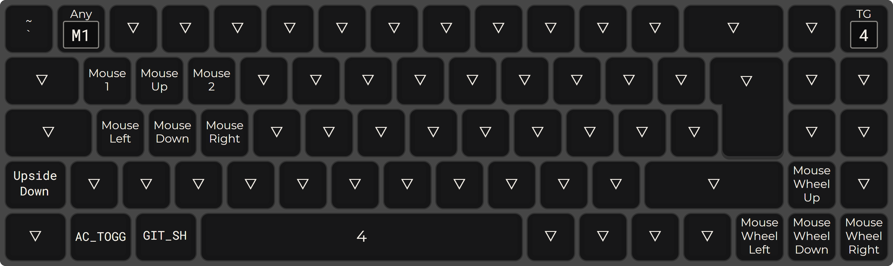

# Keychron Q7 Custom Layout

## Instructions

- Install [QMK_MSYS](https://github.com/qmk/qmk_distro_msys)
- Run `qmk setup` in QMK_MSYS
- Clone this repo into `qmk_firmware/keyboards/keychron/q7/iso/keymaps`
- Set keyboard: `qmk config user.keyboard=keychron/q7/iso`
- Set keymap: `qmk config user.keymap=Xychic_keychron_Q7`
- Compile the config and flash the keyboard: `qmk flash`, placing the keyboard in bootloader mode when required

## Resources

- Keycodes can be found at [qmk keycodes](https://docusaurus.qmk.fm/keycodes/)
- Macros and more advanced actions are discussed [getreuer.info](https://getreuer.info/posts/keyboards/index.html)
- Images created by using `qmk c2json` in QMK_MSYS and uploading to [config.qmk.fm](https://config.qmk.fm/#/keychron/q7/iso/LAYOUT_iso_73) with `GMK WOB` colourway

## Layer 0

## Layer 1

## Layer 2

## Layer 3

## Layer 4

